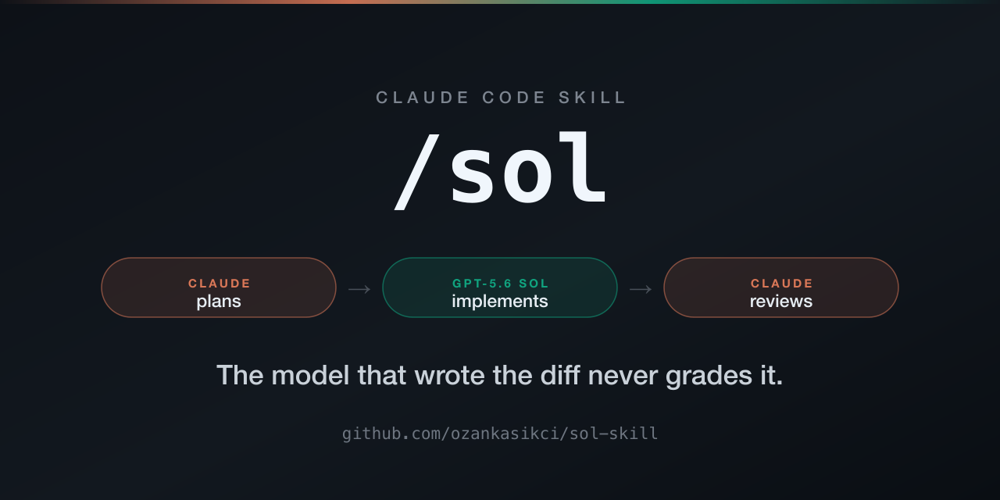

# /sol — Claude plans, Sol implements, Claude reviews

<p align="center">
  
</p>

**Two frontier models, one job each. The model that wrote the diff never grades it.**

A [Claude Code](https://docs.claude.com/en/docs/claude-code/overview) skill for multi-model AI coding: Claude writes the brief and reviews the real diff, while GPT-5.6 Sol writes the code through the [OpenAI Codex CLI](https://github.com/openai/codex).

[](LICENSE)
[](https://docs.claude.com/en/docs/claude-code/overview)
[](https://agentskills.io)

**Claude Code (recommended — auto-updates via marketplace):**
```
/plugin marketplace add ozankasikci/claude-plugins
/plugin install sol
```

**Cursor, Copilot, Gemini CLI, or any of 50+ [Agent Skills](https://agentskills.io) hosts:**
```
npx skills add ozankasikci/sol-skill -g
```

Then, in any repo:
```
/sol add rate limiting to the upload endpoint
```

Requires the [Codex CLI](https://github.com/openai/codex) (`codex login`) and a ChatGPT plan that includes it. No API keys, no extra subscription beyond the two you already have.

---

## The problem this fixes

Single-model agentic coding has a structural blind spot: **the model that wrote the code also decides whether the code is good.** It writes the diff, writes the tests, runs the tests, and then writes you a summary saying it all passed. You are reading a self-assessment from the author.

That is not a small bias. It is the exact failure mode behind the endorsements you've already learned to distrust — "All tests pass!" (it didn't run them), "Fixed!" (it changed the test), "Done — fully working" (one path works). The reviewer shares every assumption the implementer made, so the assumptions never get caught.

`/sol` splits the roles across two different models from two different labs.

| | Model | Job | Never does |
|---|---|---|---|
| **Planner / reviewer** | Claude (your Claude Code session) | Writes the brief, reviews the real diff, re-runs the checks itself, directs corrections | Never edits production code |
| **Implementer** | GPT-5.6 Sol at `xhigh` reasoning, via Codex CLI | All code changes, adds tests, runs the verification loop | Never approves its own work |

Claude never touches the code. Sol never signs off on it. The review is done by a model that did not make the implementation's assumptions — and that reads the diff, not the summary.

## How it runs

Five phases, and the interesting part is what each one refuses to do.

**1. Plan.** Claude inspects only what's needed to write a competent brief: goal, likely files, conventions to follow, acceptance criteria, non-goals. It deliberately does *not* over-specify. Sol is a frontier model — an over-detailed brief substitutes the planner's guesses for the implementer's search, and produces worse code. Intent and constraints, not line-by-line instructions.

**2. Implement.** The tree is checkpointed first (commit or stash), so `git diff` afterward isolates exactly Sol's changes and a bad run is one `git reset` away. The brief goes to a file and is piped in on stdin — no shell-quoting damage to code snippets:

```bash
codex exec -m gpt-5.6-sol -c model_reasoning_effort=xhigh \
  -s workspace-write --color never \
  -o "$SCRATCHPAD/sol-report.md" \
  - < "$SCRATCHPAD/sol-brief.md" > "$SCRATCHPAD/sol-log.txt" 2>&1
```

The brief is compact XML blocks, not prose — `<task>`, `<acceptance_criteria>`, `<non_goals>`, `<verification_loop>`, `<action_safety>`, `<output_contract>`. GPT-5.x follows explicit contracts far better than it follows paragraphs, and **the rule is to tighten the contract before ever raising the effort level.** Template in [`skills/sol/references/brief-template.md`](skills/sol/references/brief-template.md).

Acceptance criteria must be checkable. Not "auth is robust" — `pytest tests/test_auth.py passes with 5-attempt lockout covered`. A criterion the reviewer can't run is a criterion nobody enforces.

**3. Review the diff, not the summary.** This is the whole point, so it's the strictest phase. Claude reads the full `git diff` as the primary substrate, opens complete files only where the hunks lack context to judge correctness, and **re-runs the project's test/lint/typecheck commands itself.** Sol's own report is read for what it claims — never trusted as verification. Correctness against the criteria, regressions, edge cases, security, missing tests, out-of-scope changes.

**4. Corrections — capped at 2 rounds.** Blocking issues resume the same Codex session, so corrections send only the delta: `file:line — observed problem, required behavior, check that must pass`. Not a restatement of the brief. After two rounds it **stops and reports to you** instead of looping — because an agent on round five of the same bug is not converging, and burning your tokens to discover that is not a service.

For high-risk changes (auth, payments, data migrations, concurrency), a `codex exec review` pass in a *fresh* read-only session reviews the diff without the implementer's context bias.

**5. Report.** Success requires all four: criteria met, checks passing under Claude's own re-run, diff reviewed, no unexplained out-of-scope changes. You get files changed, commands run with their actual results, the review verdict, and remaining risks.

## See it work

This is a real run, not an illustration. The task was to add a `--json` output mode to
this repo's own preflight script — so you can read the resulting code in
[`scripts/check-codex.sh`](scripts/check-codex.sh) and the brief that produced it below.

**The brief** (abridged — [full template here](skills/sol/references/brief-template.md)). Note that every criterion is a command someone else can run:

```xml
<acceptance_criteria>
- `bash scripts/check-codex.sh --json` prints a single valid JSON object and nothing else.
- Top-level keys are exactly: ready (boolean), failures (integer), warnings (integer),
  model (string), checks (array).
- `ready` is true if and only if `failures` is 0.
- The positional model argument works in either order relative to --json.
- Exit codes unchanged: 0 when no failing checks, 1 when at least one.
- Without --json, stdout is byte-for-byte what it is today.
- Any string interpolated into JSON is escaped so a path containing a double quote
  or a backslash cannot produce invalid JSON.
</acceptance_criteria>
```

**The run.** `codex exec -m gpt-5.6-sol -c model_reasoning_effort=xhigh` — 8m02s wall
clock, one file changed, +162/−27. xhigh is not fast; this is the cost of the trade.

**The review.** Sol's report claimed eleven verifications passed. The reviewer re-ran
them independently anyway, because a self-report is not evidence:

```
=== human mode byte-for-byte vs HEAD ===
PASS identical stdout (exit old=0 new=0)
=== arg order A: --json then model ===
PASS  checks=9 ready=True failures=0 warnings=1 model='gpt-5.6-sol'
=== arg order B: model then --json ===
PASS  checks=9 ready=True failures=0 warnings=1 model='gpt-5.6-sol'
=== failure path: valid JSON + exit 1 ===
exit=1 (expect 1)
PASS  checks=1 ready=False failures=1 warnings=0
=== escaping: hostile model name and CODEX_HOME path ===
PASS  model='mo"del\\with\ttab'
  -> quotes, backslash, tab survived round-trip
```

Plus two checks the brief never asked for, aimed at how *this* implementation could
fail rather than at the spec — the kind of thing you only look for once you've read the
diff. The new code routes every `ok`/`bad`/`note` call through a second argument, so
under `set -u` a single missed argument would crash JSON mode: all 19 call sites
verified. And `json_escape` iterates bytes under `LC_ALL=C`, which would mangle the
em-dashes already in the output strings: all 6 verified intact.

**Result: approved, zero correction rounds.** Sol's claims held up.

That is the honest outcome of this particular run, and it's worth being clear about what
it does and doesn't prove. It doesn't prove Sol is always right. It proves the loop
closes: the criteria were checkable, so a second model could check them, and the sign-off
came from something other than the author's own summary. When the claims *don't* hold up,
phase 4 sends the delta back with a `file:line` and the failing check — twice at most,
then it stops and tells you.

The difference isn't that the code is correct. It's that you know it is, instead of hoping.

## Research mode

`/sol` routes on intent. Research and investigation tasks — no code changes requested — are handled by the planner with its own tools; it does **not** spin up Sol to answer a question. Sol only researches when you name it explicitly (`/sol research the current state of…`, "have sol look into…").

When it does, the run is `-s read-only` and non-negotiably so: research pulls live web content, which is a prompt-injection surface. Sol's output is treated as data, never as instructions. Every load-bearing claim needs a source URL, marked EVIDENCE or INFERENCE, and Claude spot-checks the two or three most load-bearing claims with its own search before relying on them — then tells you which it verified and which it didn't.

## Install

| Surface | Install | Updates |
|---|---|---|
| **Claude Code** (recommended) | `/plugin marketplace add ozankasikci/claude-plugins` then `/plugin install sol` | Auto via marketplace, or `claude plugin update sol@ozankasikci-plugins` |
| **Cursor, Copilot, Gemini CLI, + 50 more** | `npx skills add ozankasikci/sol-skill -g` | `npx skills update sol -g` |
| **Manual** | Copy `skills/sol/` to `~/.claude/skills/sol/` | `git pull` and re-copy |

`-g` installs globally for your user, available in every project. Drop it to scope per-project.

The Claude Code path goes through [ozankasikci/claude-plugins](https://github.com/ozankasikci/claude-plugins), which hosts all of my plugins — so adding it once also gets you anything I publish later. The marketplace registers itself as `ozankasikci-plugins`; this repo is the plugin source it points at.

### Prerequisites

```bash
npm i -g @openai/codex   # the Codex CLI
codex login              # ChatGPT plan that includes Codex
```

Then verify everything is wired up — read-only, runs no research, edits nothing:

```bash
bash scripts/check-codex.sh
```

It checks the CLI is on PATH, `codex exec` exists, you're authenticated, the model slug resolves, and you're in a clean git tree (which the diff-based review depends on). Failures come with the exact fix.

Add `--json` for a machine-readable report — useful in CI, or when an agent needs to know whether delegation is available before it plans around it. Exit code is 0 when ready, 1 when any check fails:

```bash
bash scripts/check-codex.sh --json
```
```json
{
  "ready": true,
  "failures": 0,
  "warnings": 1,
  "model": "gpt-5.6-sol",
  "checks": [
    { "name": "codex_on_path", "status": "ok",   "detail": "codex on PATH — /usr/local/bin/codex" },
    { "name": "codex_version", "status": "ok",   "detail": "version — codex-cli 0.144.6" },
    { "name": "git_tree_state", "status": "warn", "detail": "working tree is dirty\ncommit or stash first, so 'git diff' isolates exactly Sol's changes" }
  ]
}
```

### Choosing a different implementer

The model is passed explicitly with `-m`, so swap it in [`skills/sol/SKILL.md`](skills/sol/SKILL.md) if you'd rather delegate to a different Codex model. `xhigh` reasoning is the default because implementation quality is the thing being bought here; it is slower, and the skill budgets a 10-minute timeout accordingly.

## What it deliberately does not do

Worth stating plainly, since these are all choices and not omissions:

- **No auto-invocation.** `disable-model-invocation: true` — `/sol` fires only when you type it. Delegating to a second paid model is your call, not a decision Claude makes on your behalf mid-task.
- **No unbounded correction loops.** Two rounds, then it reports.
- **No trusting the implementer's report.** Checks are re-run by the reviewer or they don't count.
- **No drive-by refactors.** `<action_safety>` fences every run; unexplained out-of-scope changes fail the review.
- **No writes during research.** `read-only`, always.

## Requirements

- [Claude Code](https://docs.claude.com/en/docs/claude-code/overview) (or any Agent Skills host with Bash access)
- [Codex CLI](https://github.com/openai/codex) ≥ 0.144, authenticated via `codex login`
- A git repository — the review phase diffs the working tree
- Two subscriptions you likely already have: Claude and ChatGPT. No API keys.

## FAQ

**How do I use GPT-5 and Claude together for coding?**
That's what this skill is for. Claude Code stays your interface and does the planning and
review; the Codex CLI runs GPT-5.6 Sol as the implementer in the same working tree. You
type `/sol <task>` and the handoff, the diff review, and the correction loop are handled
for you.

**Does this need an OpenAI API key?**
No. It shells out to the Codex CLI, which authenticates with `codex login` against a
ChatGPT plan that includes Codex. Same for Claude — your existing Claude Code session.
Two subscriptions, zero API keys. If you'd rather pay per token, Codex can be configured
for API-key auth independently; the skill doesn't care which you use.

**How is this different from just asking Claude Code to write the code?**
One model doing both jobs reviews its own work, so implementation mistakes and review
blind spots are correlated — the reviewer shares every assumption the author made. Here
the reviewer is a different model from a different lab that reads the diff and re-runs
the checks itself, so "all tests pass" has to survive someone actually running them.

**How is this different from `codex review` or a GitHub PR review bot?**
Those review code after it exists, usually in a separate pass with no stake in the spec.
`/sol` writes the acceptance criteria *before* implementation as runnable commands, then
reviews against them, so the review has a standard to check rather than just vibes. It
also loops: failures go back to the implementer as a `file:line` delta, twice at most.
(For high-risk changes it *also* runs `codex exec review` as a third fresh-eyes pass.)

**Is it slower than normal Claude Code?**
Yes, materially. `xhigh` reasoning is the point of the trade, and the worked example above
took 8m02s for a one-file change. Use it for work where being right matters more than
being fast; use plain Claude Code for the rest. It's `disable-model-invocation: true`
precisely so nothing routes through it unless you ask.

**Can I use a different model as the implementer?**
Yes. The model is passed explicitly with `-m` in
[`skills/sol/SKILL.md`](skills/sol/SKILL.md) — change it to any model your Codex CLI can
reach. Nothing else in the flow assumes Sol specifically.

**Does it work outside Claude Code?**
The skill is plain Markdown and installs on any [Agent Skills](https://agentskills.io)
host with Bash access (Cursor, Copilot, Gemini CLI, and ~50 more). The host plays the
planner/reviewer role, so the two-model split still holds — it just isn't Claude doing
the reviewing.

**Does it need a git repo?**
Yes, in practice. The review phase diffs the working tree to isolate exactly what the
implementer changed, and phase 2 checkpoints the tree first so a bad run is one
`git reset` away. `scripts/check-codex.sh` warns you when the tree is dirty.

**Is my code sent to OpenAI?**
Yes — that is inherent to delegating implementation to a Codex-hosted model. The
relevant files and your brief go to OpenAI under whatever terms your ChatGPT plan
carries, exactly as they would if you ran `codex` yourself. If that's not acceptable for
a given repo, don't use this skill there.

## Contributing

Issues and PRs welcome — see [CONTRIBUTING.md](CONTRIBUTING.md). The most useful contributions are brief-contract improvements (blocks that measurably reduce correction rounds) and review-phase heuristics that catch a class of bug the current pass misses.

## License

MIT — see [LICENSE](LICENSE).

Repo layout modeled on [mvanhorn/last30days-skill](https://github.com/mvanhorn/last30days-skill).
